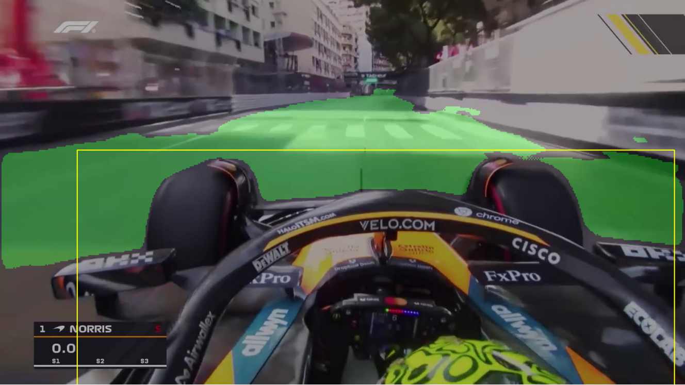
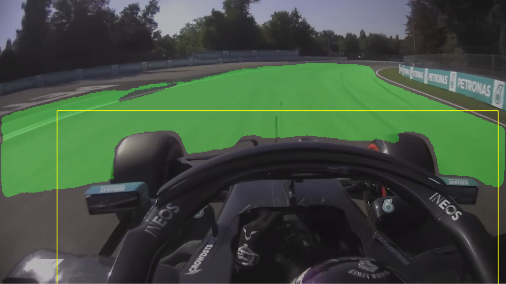
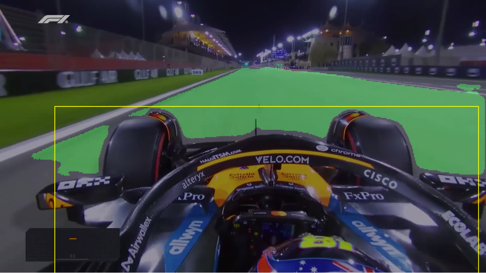
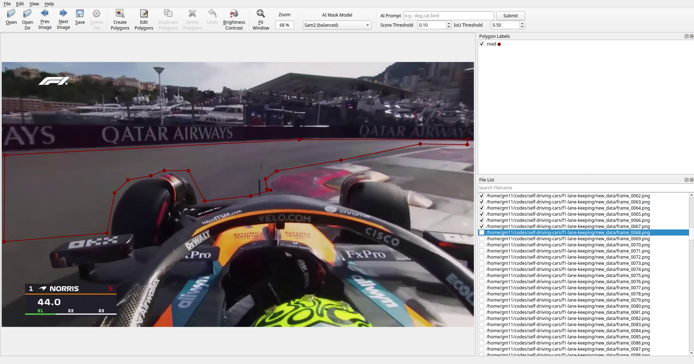

# F1 Lane Keeping System

A project that detects lane markings in Formula 1 race footage using a custom U-Net deep learning model. The system processes video frames in real-time to identify lane boundaries and visualize them with overlay graphics.

## 📸 Visual Examples

### Lane Detection Results
<p align="center">
  
  
</p>

<p align="center">
  
</p>


### Dataset Creation Process
<p align="center">
  
</p>

*Manual annotation of F1 footage using labelme tool to create training dataset*

## 🏎️ Features

- **Real-time Lane Detection**: Processes F1 race videos frame by frame
- **Custom U-Net Architecture**: Deep learning model specifically trained for lane detection
- **Video Processing**: Supports MP4 video files with OpenCV

## 🧠 Model Architecture

The project uses a custom U-Net architecture optimized for lane detection:

- **Encoder**: 6 downsampling blocks with skip connections
- **Bottleneck**: 1024-channel feature extraction
- **Decoder**: 6 upsampling blocks with concatenated skip connections
- **Output**: Single-channel binary mask for lane pixels
- **Input Size**: 256×512 pixels
- **Activation**: Sigmoid with 0.4 threshold for binary classification

### Model Performance
- Trained on custom F1 race footage dataset (`f1_road_dataset`)
- Dataset created using manual labeling of F1 onboard camera footage with [labelme](https://github.com/wkentaro/labelme)
- Uses data augmentation (horizontal flip, rotation, brightness/contrast adjustment)
- Optimized for detecting lane markings on race tracks

## 🛠️ Utility Scripts

### Data Collection & Preparation
- `download_vid_from_youtube.py`: Download F1 videos from YouTube
- `capture_frames.py`: Extract frames from video files
- `convert_json_to_mask.py`: Convert labelme JSON annotations to binary masks
- `train_val_split.py`: Split dataset into training/validation sets

**Dataset Creation Process:**
1. F1 onboard camera footage is downloaded and processed
2. Individual frames are extracted using `capture_frames.py`
3. Manual annotation is performed using [labelme](https://github.com/wkentaro/labelme) to mark lane boundaries (see image above)
4. JSON annotations are converted to binary masks for training
5. Dataset is split into training and validation sets

### Model Training
- `lane_detection_u_net.py`: Complete training pipeline
- `lane_dataset_class.py`: PyTorch dataset implementation

### Computer Vision
- `detect_lanes.py`: Traditional OpenCV lane detection methods

## 📊 Technical Specifications

### Input Requirements
- **Video Format**: MP4 (H.264 codec recommended)
- **Resolution**: Any (automatically resized to 256×512 for inference)
- **Frame Rate**: Preserved during playback

### Model Specifications
- **Framework**: PyTorch
- **Input Shape**: (3, 256, 512) - RGB images
- **Output Shape**: (1, 256, 512) - Binary lane mask
- **Inference Time**: ~10-50ms per frame (depends on hardware)

### Dependencies
- **Core**: PyTorch, OpenCV, NumPy
- **Visualization**: Matplotlib
- **Data Processing**: Albumentations, scikit-learn
- **Utilities**: yt-dlp (YouTube downloads), labelme (manual annotations)

## 🔧 Configuration

### Model Parameters
```python
IMG_HEIGHT, IMG_WIDTH = 256, 512
threshold = 0.4  # Binary classification threshold
```

### Data Preprocessing
```python
# Normalization (ImageNet statistics)
mean = (0.485, 0.456, 0.406)
std = (0.229, 0.224, 0.225)
```

## 🚦 Lane Detection Pipeline

1. **Frame Preprocessing**:
   - Convert BGR to RGB
   - Resize to 256×512
   - Normalize using ImageNet statistics
   - Convert to PyTorch tensor

2. **Model Inference**:
   - Forward pass through U-Net
   - Apply sigmoid activation
   - Threshold at 0.4 for binary mask

3. **Post-processing**:
   - Resize mask to original frame dimensions
   - Create green overlay for detected lanes
   - Blend with original frame (30% opacity)

4. **Visualization**:
   - Add car position bounding box
   - Display processed frame
